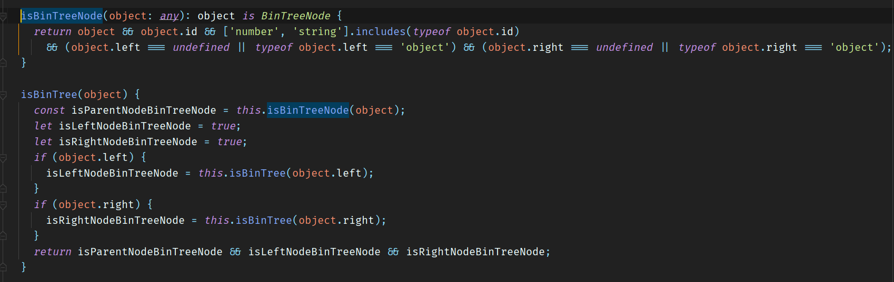
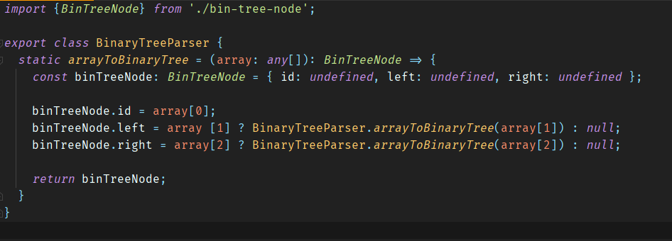
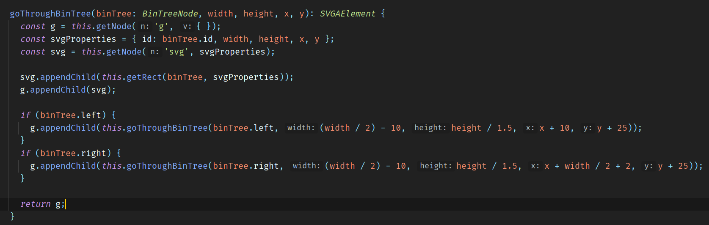
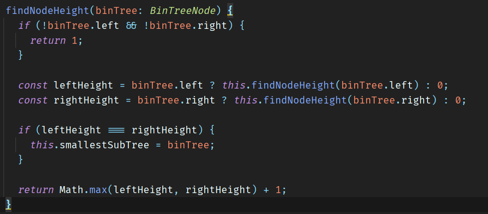
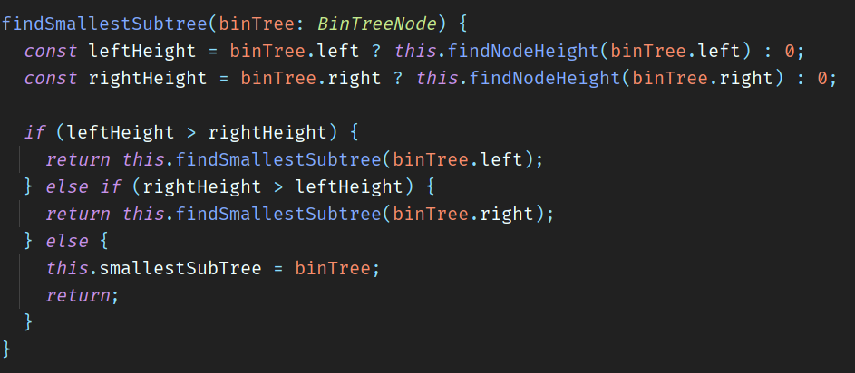

# Bin Tree Node
 
## Enhancements:
- I used a Drop File plugin to ease using files.
- I added a Recently Used Files table that shows the file name and file content of the files saved in Local Storage. You can use the "Use File" button to enter the file content in the Tree Text code.
- For the Tree Code section I used the Monaco plugin that uses Microsoft Monaco editor.
- I added an error message that shows when the JSON does not have a proper structure, when one of the BinTreeNode is not Object, number, string or null and when you browse a file that is not JSON or text extension.
- For verifying if the JSON structure is the correct one I created a recursive method:  

(The second one is the recursive one, the first one is just used to check the properties types)

## Thought process
For every solution I made I had to think recursively and use the dev tools debugger for really know how I was going to code.

## Solutions
### Problem 1

Found in: binary-tree-parser.ts

For this solution I created a class with a static method, so I don't need to instantiate the class.

This method is recursive, it gets the first element (of three) in the array and assigns it as the id of the current binTreeNode, checks if it has left binTreeNode to send it to the method itself, else, assigns null.
The same with the right binTreeNode. At the end we have a full BinTreeNode made with the array.

### Problem 2

Found in: app.component.ts

For this solution I created a recursive method to create svg elements, it receives a width and height, and the coordinates to position the SVGAElement, the getNode creates and returns a svg element and appends it to the current svg element, then creates appends recursively the svg elements for each left and right bin tree of each bin tree. The getRect method is used to create the g element (to group the text and rect) and appends it to the current svg.

I also use a method describe in problem 3 to get the height of the whole bin tree, and I multiply that height, so the whole rectangle gets bigger as the number of nodes increments.

### Problem 3

Found in: app.component.ts

For this solution I created two recursive methods, one for getting the height of a node and another one to find the smallest sub tree.

I also use the method getRect used in Solution 2 to color the green border.

This method finds the max (recursively) comparing left and right bin tree nodes and sums 1 to have the height.

In this other method we get the height of left and right nodes, if left height is bigger than right's, it changes the root binTree to the left one and vice versa, to know if we found the smallest sub tree, just need to know if the left and right height is the same and assign that subtree to a global variable.
Then in the getRect method we use it to compare the current node to the smallestSubTree variable, if those are the same, the rectangle stroke it's green.

